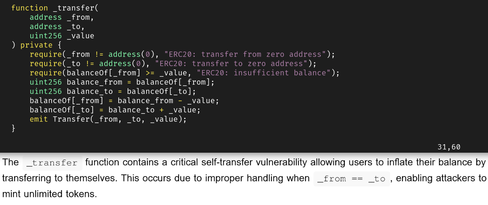
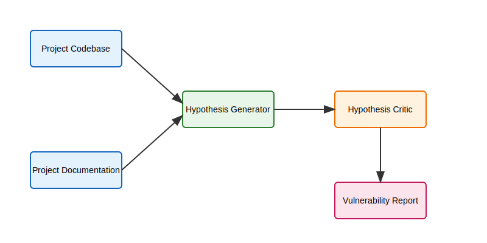

# savant 🤖
Smart Contract auditing agent for Agentic Ethereum Hackathon

> ⚠️ **Important Notice**: This repository contains limited version of the final product. We are currently withholding the full version due to its exceptional effectiveness at discovering critical vulnerabilities in smart contracts. The full version will be published after careful consideration of responsible disclosure practices.

Live demo is available at [savant.chat](https://savant.chat/)

## Bug finding example 🐛



## System Architecture 🏗️



## How it works 🔍

The Savant AI auditor operates through a sophisticated multi-stage process to identify and validate potential vulnerabilities in smart contracts:

1. **Input Processing** 📥
   - Project Codebase: The system accepts Solidity smart contract code as input
   - Project Documentation: Supporting documentation helps provide context for the analysis

2. **Analysis Pipeline** ⚡
   - **Hypothesis Generator** 🧪: The first AI agent (powered by GPT) analyzes the smart contract code to identify potential security vulnerabilities. It uses a carefully crafted prompt that focuses on critical security issues.

   - **Hypothesis Critic** 🔍: A second AI agent acts as a critic, independently validating each potential vulnerability identified by the generator. This helps reduce false positives by providing an additional layer of verification.

3. **Output** 📊
   - **Vulnerability Report** 📝: The final output is a detailed security report that includes:
     - Validated vulnerabilities (confirmed by both generator and critic) ✅
     - Rejected findings (identified by generator but rejected by critic) ❌
     - Severity assessments 🚨
     - Code context for each issue 📄
     - Detailed descriptions and explanations 📋

## Features ⭐

- Concurrent analysis of multiple security aspects 🔄
- Two-stage validation process to minimize false positives ✔️
- Detailed logging and audit trail 📝
- Exponential backoff retry mechanism for API reliability 🔁
- Structured output with clear differentiation between confirmed and rejected findings 📊

## Usage 🛠️

```bash
python simple-agent.py <solidity_file>
```

The tool will analyze the provided smart contract and generate a comprehensive security report highlighting any identified vulnerabilities.
